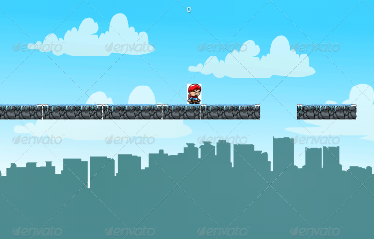
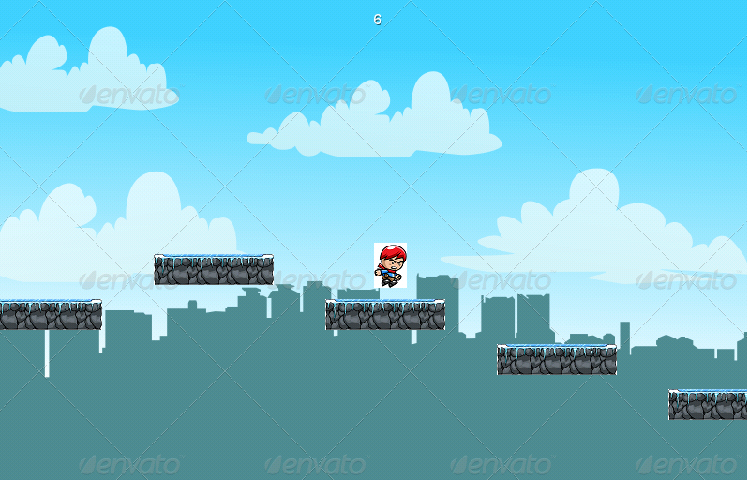
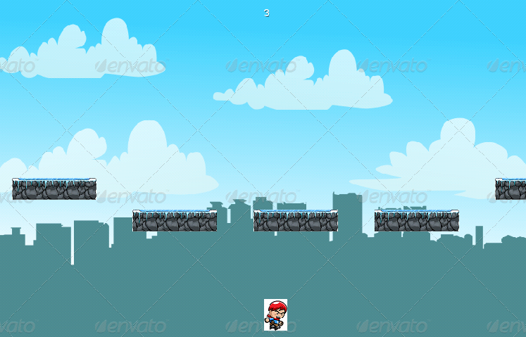

# Jumpy

Um jogo do género *2D Platformer*, cujo objetivo é atingir a maior pontuação possível fazendo a personagem saltar de plataforma em plataforma
sem deixá-lo cair para o abismo. 
Desenvolvido para Android em Java com a framework [libGDX](https://libgdx.badlogicgames.com/) e inspirado no famoso jogo "Flappy Bird".

# Instalação em dispositivo Android

Pode instalar o jogo no seu dispositivo com o ficheiro [android.apk](https://github.com/Adtx/Jumpy/blob/master/out/production/android/android.apk).

# Screenshots

* **Ecran de fim do jogo** (com pontuação recorde e último resultado)

* **Gameplay**

